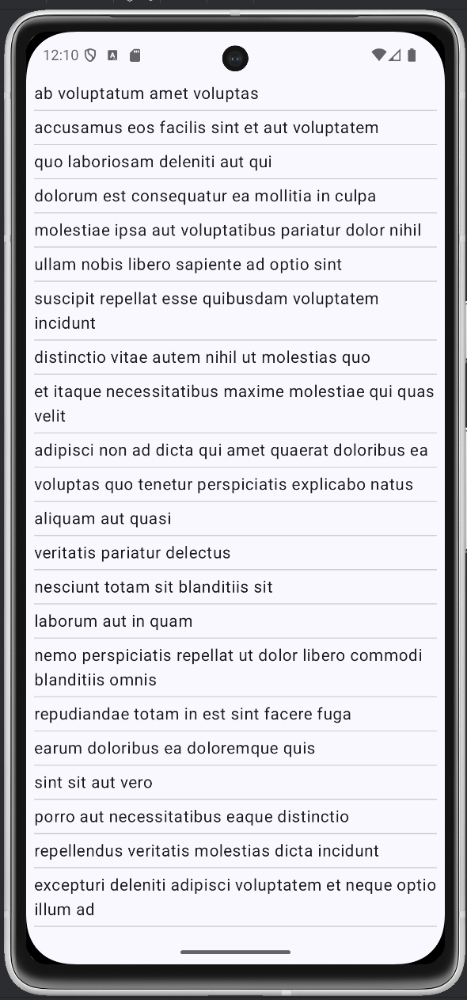

# Native technologies in Mobile Programming

**Exercise. Todo – Creating MVVM and reading API containing JSON**
> Creating MVVM architecture for Android app and app will retrieve data through API which
return JSON data.

## App image

